# 🛫 BOOKING AGENT - SYSTEM FLOW & ARCHITECTURE

## 📋 TỔNG QUAN HỆ THỐNG

Hệ thống **Booking Agent** là một AI-powered chatbot chuyên về đặt vé máy bay VietJet Air và tư vấn dịch vụ du lịch SOVICO. Được thiết kế theo kiến trúc **Multi-Agent** với khả năng xử lý ngôn ngữ tự nhiên tiếng Việt và conversation flow thông minh.

## 🏗️ KIẾN TRÚC TỔNG THỂ

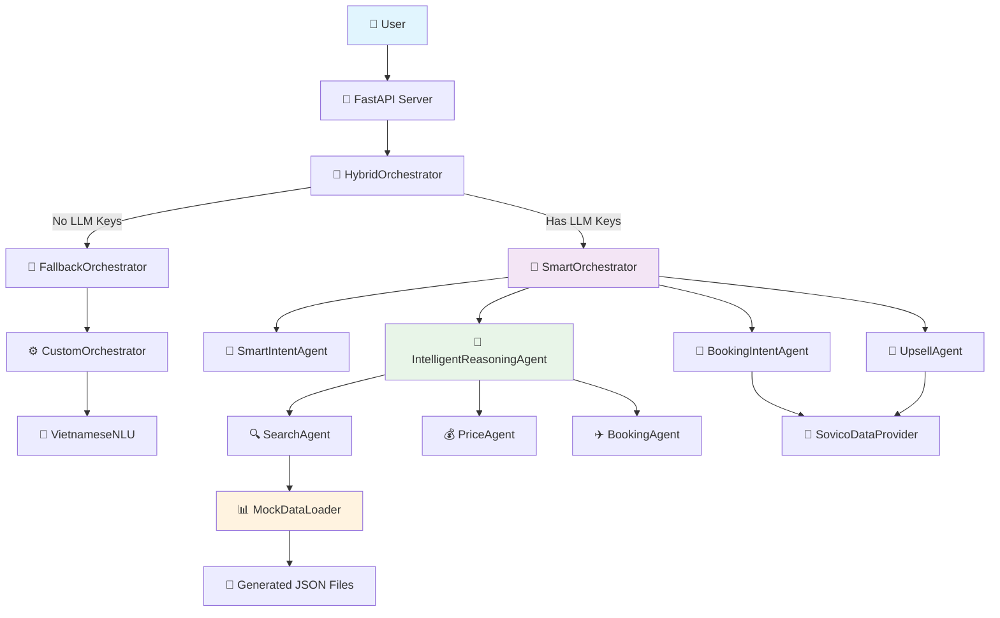

## 🚀 ENTRY POINT FLOW

### 1. **main.py - FastAPI Server**

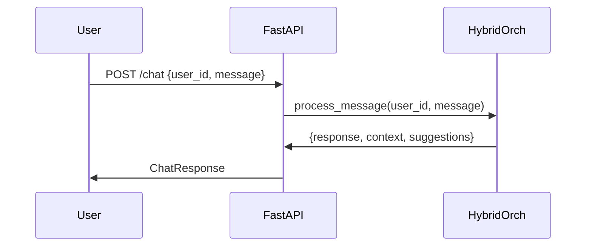

**Chức năng chính:**
- Khởi tạo FastAPI server với endpoint `/chat`
- Nhận `ChatRequest` từ user
- Delegate processing cho `HybridOrchestrator`
- Trả về structured `ChatResponse`

## 🧠 HYBRID ORCHESTRATOR

### **Decision Logic**

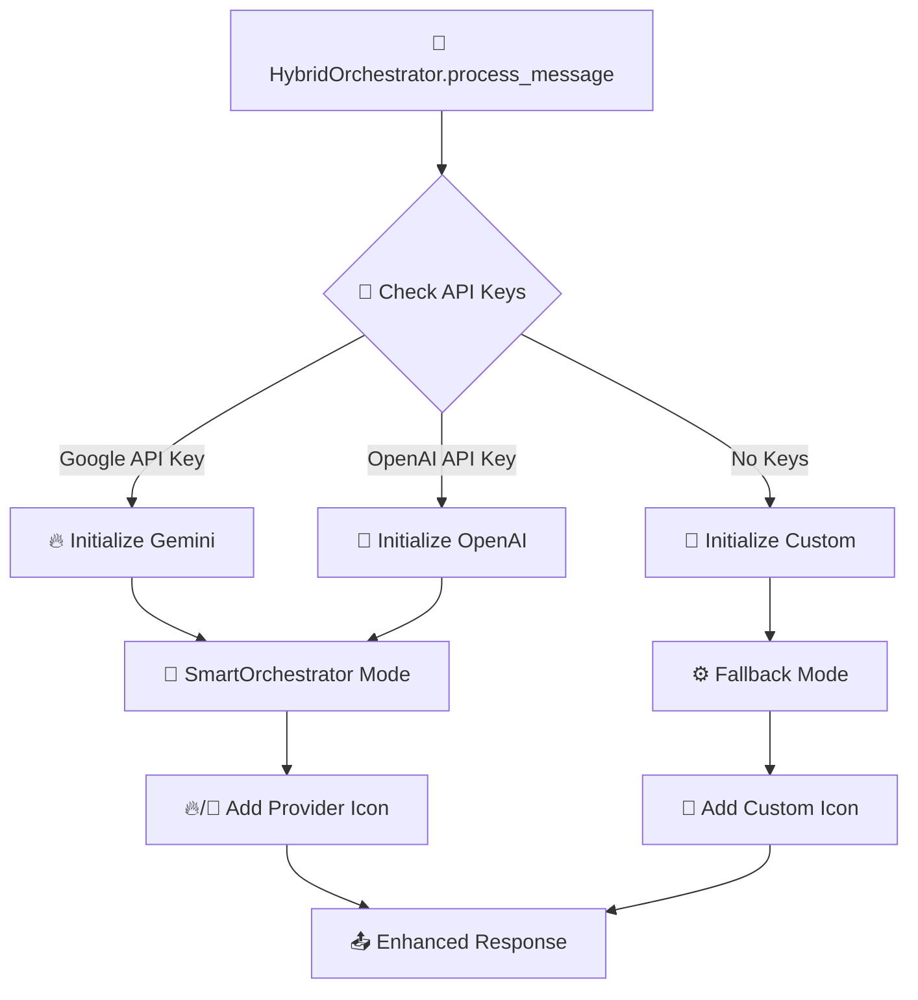

**Provider Priority:**
1. **Google Gemini** (🔥) - Primary choice
2. **OpenAI GPT** (🧠) - Secondary choice  
3. **Custom Logic** (🔧) - Fallback

## 🎯 SMART ORCHESTRATOR FLOW

### **Main Processing Pipeline**

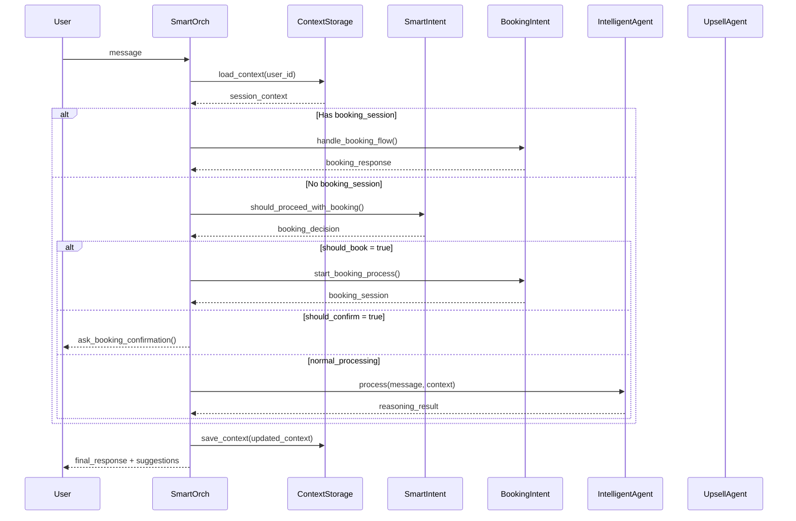

## 🤖 INTELLIGENT REASONING AGENT

### **Multi-Step Reasoning Process**

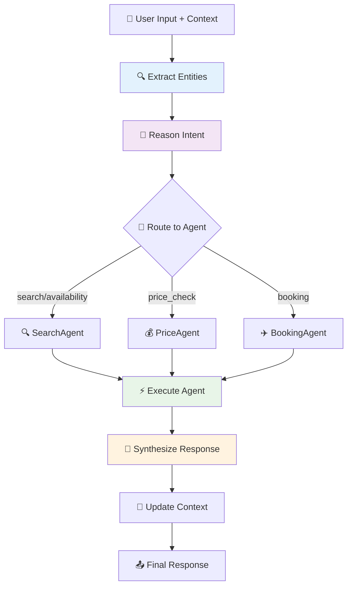

### **Entity Extraction với LLM**

```json
{
  "locations": {"from": "Ho Chi Minh City", "to": "Hanoi"},
  "time": {"date": "ngày mai", "time_preference": "sáng"},
  "passengers": 1,
  "preferences": {"price_range": "cheapest"},
  "intent_signals": ["tìm vé", "rẻ nhất"],
  "conversation_type": "search"
}
```

### **Intent Analysis**

```json
{
  "primary_intent": "search",
  "target_agent": "SearchAgent", 
  "ready_for_action": true,
  "confidence": 0.9
}
```

## 🔍 SEARCH AGENT FLOW

### **Flight Search Process**

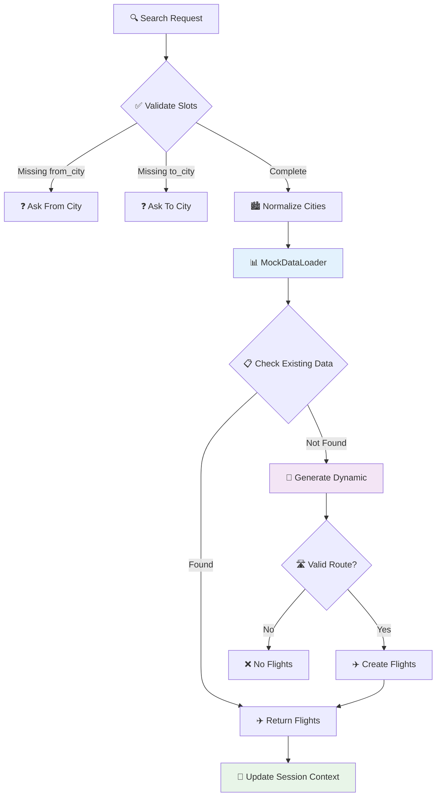

### **Dynamic Flight Generation**

```python
# Seed-based generation để đảm bảo consistency
seed_string = f"{from_code}-{to_code}-{target_date}"
random.seed(hash(seed_string) % (2**32))

# Generate 5-8 flights với giá và thời gian cố định
flight_times = ["06:00", "08:30", "10:15", "12:45", "15:20", "17:30", "19:45", "21:15"]
base_prices = {"HAN-SGN": 1500000, "SGN-HAN": 1500000, "SGN-DAD": 1200000}
```

## 📝 BOOKING FLOW - Multi-Step Process

### **Complete Booking Journey**

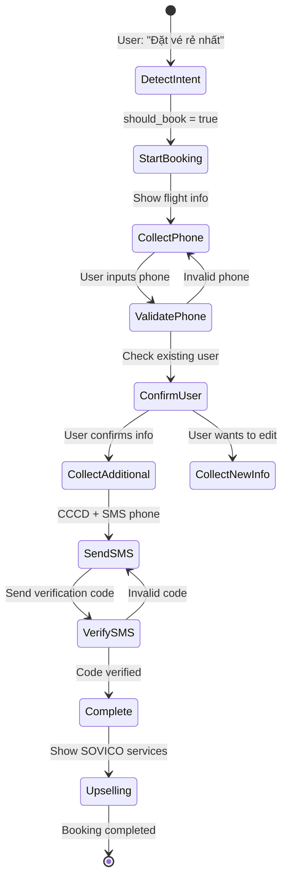

### **Booking Session State**

```json
{
  "session_id": "booking_VJ112_1234",
  "step": "collect_phone",
  "flight_info": {
    "flight_id": "VJ112",
    "airline": "VietJet Air",
    "from_city": "Ho Chi Minh City",
    "to_city": "Hanoi",
    "date": "22/09/2025",
    "time": "06:00",
    "price": 1665967
  },
  "phone": "0901234567",
  "cccd": "123456789012",
  "sms_phone": "0901234567"
}
```

### **Booking Steps Detail**

#### **Step 1: Collect Phone**
```
📱 Để tiếp tục đặt vé, vui lòng cung cấp số điện thoại:
(Chúng tôi sẽ kiểm tra thông tin khách hàng có sẵn)
```

#### **Step 2: Confirm User Info**
```
👤 THÔNG TIN KHÁCH HÀNG
Họ tên: Nguyễn Văn A
SĐT: 0901234567
Email: nguyenvana@email.com
Địa chỉ: 123 Nguyễn Huệ, Q1, TP.HCM

✅ Thông tin này có đúng không?
```

#### **Step 3: Collect Additional Info**
```
📝 VUI LÒNG CUNG CẤP THÊM:
1. Số CCCD/CMND (12-15 số)
2. SĐT nhận SMS xác thực

Ví dụ: "CCCD: 123456789012, SMS: 0901234567"
```

#### **Step 4: SMS Verification**
```
📱 MÃ XÁC THỰC ĐÃ GỬI
Mã xác thực đã được gửi đến 0901234567
Vui lòng nhập mã 6 số để hoàn tất đặt vé.

📝 Mã test: 123456
```

#### **Step 5: Completion + Upselling**
```
🎉 ĐẶT VÉ THÀNH CÔNG!

✈️ VietJet Air VJ112
📍 TP.HCM → Hà Nội  
📅 22/09/2025 lúc 06:00
💰 1.665.967 VNĐ
🆔 Mã booking: SOVICO220925VJ112

🏨 DỊCH VỤ BỔ SUNG TẠI HÀ NỘI:
🏨 Sovico Grand Hotel Hanoi - 2.200.000đ/đêm
🚗 Xe đón sân bay - 380.000đ/chuyến  
🎯 Tour Hà Nội Heritage - 890.000đ/người
🛡️ Bảo hiểm du lịch - 50.000đ/người
```

## 💎 UPSELLING SYSTEM

### **Context-Aware Service Suggestions**

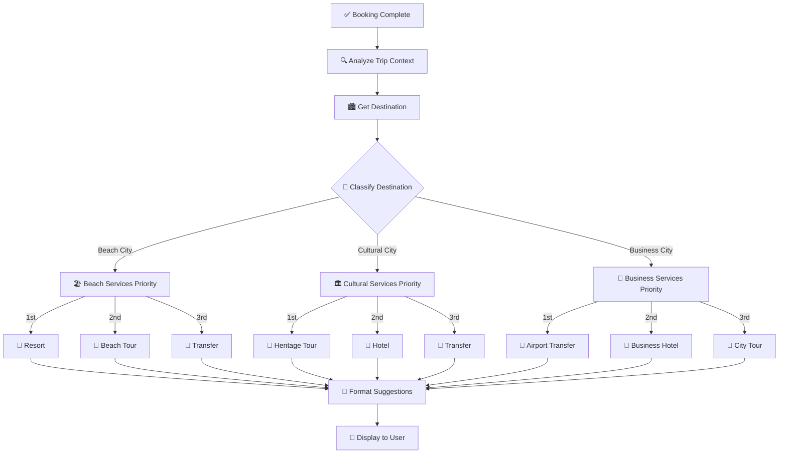

### **SOVICO Services Data Structure**

```json
{
  "hotels": {
    "hanoi": [
      {
        "id": "sovico_hn_001",
        "name": "Sovico Grand Hotel Hanoi",
        "rating": 5,
        "price": 2200000,
        "discount": "Giảm 20% + miễn phí breakfast cho khách VietJet",
        "amenities": ["Pool", "Spa", "Gym", "Business Center"]
      }
    ]
  },
  "transfers": {
    "hanoi": {
      "price": 380000,
      "vehicles": ["Toyota Vios", "Toyota Innova", "Mercedes E-Class"],
      "features": ["Tài xế chuyên nghiệp", "Theo dõi chuyến bay real-time"]
    }
  },
  "tours": {
    "hanoi": [
      {
        "name": "Hà Nội Heritage Tour",
        "price": 890000,
        "duration": "1 ngày (8h)",
        "highlights": ["Văn Miếu", "Hồ Hoàn Kiếm", "Phố Cổ"]
      }
    ]
  }
}
```

## 🧩 NLU ENGINE - Vietnamese Processing

### **Intent Detection với Semantic Scoring**

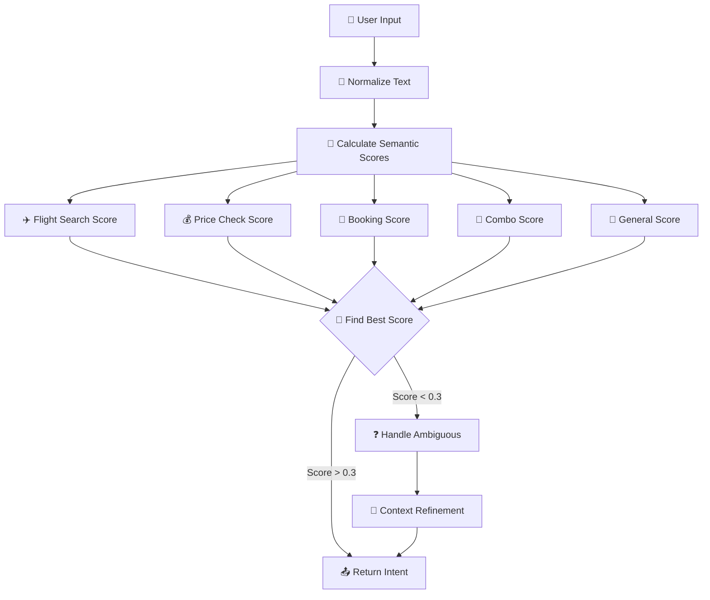

### **Semantic Keywords với Trọng Số**

```python
semantic_keywords = {
    'flight_search': {
        'strong': ['tìm vé', 'chuyến bay', 'máy bay'],      # 3 điểm
        'medium': ['tìm', 'vé', 'bay', 'chuyến'],          # 1 điểm  
        'weak': ['từ', 'đến', 'đi', 'khởi hành']           # 0.3 điểm
    },
    'price_check': {
        'strong': ['giá vé', 'bao nhiêu tiền', 'vé rẻ nhất'],
        'medium': ['giá', 'tiền', 'bao nhiêu', 'rẻ'],
        'weak': ['nhất', 'cả', 'thế nào']
    },
    'booking': {
        'strong': ['đặt vé', 'book vé', 'mua vé'],
        'medium': ['đặt', 'book', 'mua', 'chốt'],
        'weak': ['ngay', 'luôn', 'cho tôi']
    }
}
```

### **Slot Extraction - Flexible Parsing**

```mermaid
flowchart TD
    Message[📝 Message] --> ExtractLocations[🏙️ Extract Locations]
    ExtractLocations --> PatternDi[🔍 Pattern: "X đi Y"]
    ExtractLocations --> PatternFromTo[🔍 Pattern: "từ X đến Y"]
    ExtractLocations --> FuzzyMatch[🎯 Fuzzy Matching]
    
    Message --> ExtractDates[📅 Extract Dates]
    ExtractDates --> RelativeTime[⏰ Relative: "hôm nay", "ngày mai"]
    ExtractDates --> AbsoluteTime[📆 Absolute: "22/09/2025"]
    ExtractDates --> WeekdayTime[📅 Weekday: "thứ hai"]
    
    Message --> ExtractPrefs[⚙️ Extract Preferences]
    ExtractPrefs --> PricePrefs[💰 "rẻ nhất", "giá rẻ"]
    ExtractPrefs --> TimePrefs[⏰ "sáng", "chiều", "tối"]
    ExtractPrefs --> ClassPrefs[🎫 "business", "economy"]
    
    PatternDi --> NormalizeSlots[🔧 Normalize Slots]
    PatternFromTo --> NormalizeSlots
    FuzzyMatch --> NormalizeSlots
    RelativeTime --> NormalizeSlots
    AbsoluteTime --> NormalizeSlots
    WeekdayTime --> NormalizeSlots
    PricePrefs --> NormalizeSlots
    TimePrefs --> NormalizeSlots
    ClassPrefs --> NormalizeSlots
    
    NormalizeSlots --> ReturnSlots[📤 Return Slots]
```

### **Location Mapping**

```python
location_mapping = {
    # Hà Nội
    "hà nội": "HAN", "hanoi": "HAN", "hn": "HAN", "thủ đô": "HAN",
    
    # TP.HCM  
    "hồ chí minh": "SGN", "sài gòn": "SGN", "hcm": "SGN", "sgn": "SGN",
    
    # Đà Nẵng
    "đà nẵng": "DAD", "da nang": "DAD", "đn": "DAD", "miền trung": "DAD"
}
```

## 💾 CONTEXT MANAGEMENT

### **Session Context Structure**

```json
{
  "user_id": "user_123",
  "locations": {
    "from": "Ho Chi Minh City",
    "to": "Hanoi"
  },
  "time": {
    "date": "2025-01-21",
    "time_preference": "sáng"
  },
  "passengers": 1,
  "preferences": {
    "price_range": "cheapest"
  },
  "last_search_result": {
    "success": true,
    "data": {
      "flights": [...]
    }
  },
  "selected_flight_id": "VJ112",
  "booking_session": {
    "session_id": "booking_VJ112_1234",
    "step": "collect_phone",
    "flight_info": {...}
  }
}
```

### **Context Storage Flow**

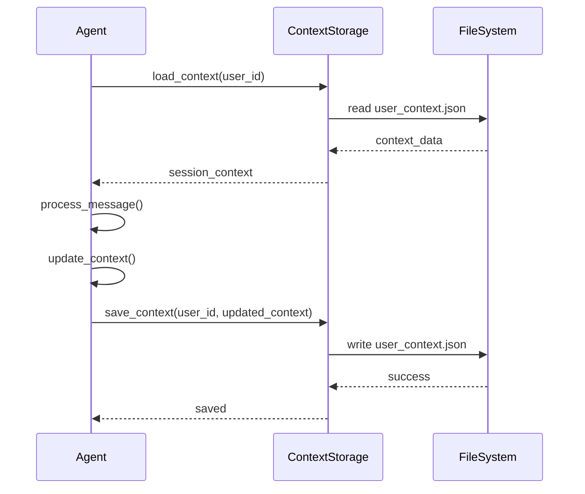

## 📊 DATA LAYER

### **MockDataLoader Architecture**

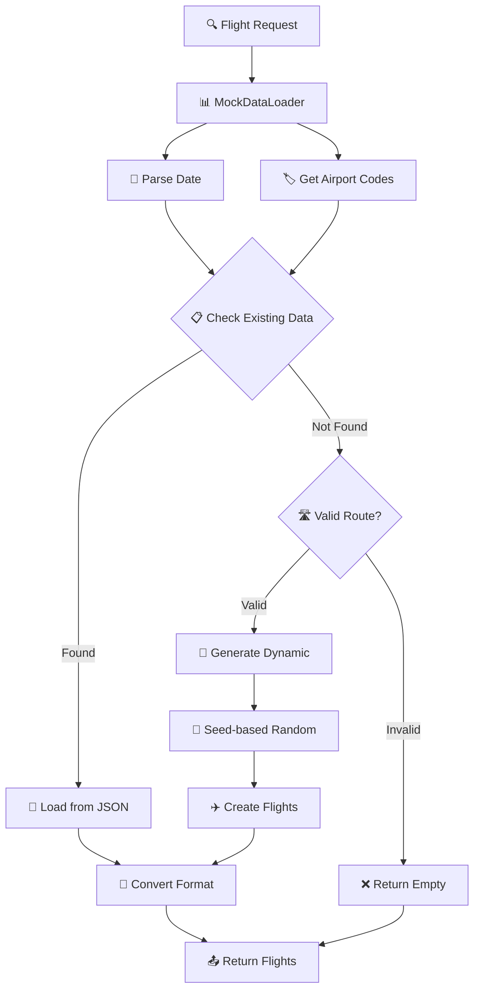

### **Dynamic Generation Logic**

```python
# Tạo seed cố định để đảm bảo consistency
seed_string = f"{from_code}-{to_code}-{target_date.strftime('%Y-%m-%d')}"
random.seed(hash(seed_string) % (2**32))

# Generate flights với thông tin cố định
flight_times = ["06:00", "08:30", "10:15", "12:45", "15:20", "17:30", "19:45", "21:15"]
base_prices = {
    "HAN-SGN": 1500000, 
    "SGN-HAN": 1500000, 
    "SGN-DAD": 1200000, 
    "DAD-SGN": 1200000
}

# Số lượng flights: 5-8 chuyến
num_flights = 5 + (hash(seed_string) % 4)

for i, time in enumerate(flight_times[:num_flights]):
    price_variation = 0.8 + (i * 0.15)  # Giá tăng dần theo giờ
    flight = {
        "flight_id": flight_codes[i % len(flight_codes)],
        "time": time,
        "price": int(base_price * price_variation),
        "seats_left": 2 + (i % 6)  # 2-7 chỗ
    }
```

## 🔄 CONVERSATION EXAMPLES

### **Example 1: Simple Flight Search**

```
User: "Tìm vé từ HCM đi HN ngày mai"

System Flow:
1. NLU: intent=flight_search, slots={from_city: "SGN", to_city: "HAN", date: "tomorrow"}
2. SearchAgent: get_flights_by_route_and_date("Ho Chi Minh City", "Hanoi", "2025-01-21")
3. MockDataLoader: generate_dynamic_flights() → 6 flights
4. Response: "🛫 Tìm thấy 6 chuyến bay từ TP.HCM đến Hà Nội"

Bot: "🛫 Tìm thấy 6 chuyến bay từ TP.HCM đến Hà Nội ngày 21/01/2025:

1. ✈️ VietJet Air VJ112
   ⏰ 06:00 - 08:05 (2h05m)
   💰 1.200.000đ
   🪑 Còn 3 ghế

2. ✈️ VietJet Air VJ114  
   ⏰ 08:30 - 10:35 (2h05m)
   💰 1.380.000đ
   🪑 Còn 5 ghế

3. ✈️ VietJet Air VJ116
   ⏰ 10:15 - 12:20 (2h05m) 
   💰 1.560.000đ
   🪑 Còn 2 ghế

Suggestions: [💰 Vé rẻ nhất, 🎯 Đặt VJ112, 🎁 Combo du lịch, 📅 Ngày khác]"
```

### **Example 2: Price Check**

```
User: "Vé rẻ nhất bao nhiêu?"

System Flow:
1. Context: có last_search_result từ query trước
2. NLU: intent=price_check, context_aware=true
3. PriceAgent: find cheapest from last_search_result
4. Response: highlight cheapest flight

Bot: "💰 Vé rẻ nhất từ TP.HCM đến Hà Nội ngày 21/01:

✈️ VietJet Air VJ112
⏰ 06:00 - 08:05
💰 1.200.000đ (rẻ nhất)
🪑 Còn 3 ghế

Suggestions: [🎯 Đặt vé này, ⏰ Xem giờ khác, 📅 Xem ngày khác, 🔍 So sánh giá]"
```

### **Example 3: Complete Booking Flow**

```
User: "Đặt vé rẻ nhất"

System Flow:
1. SmartIntentAgent: should_proceed_with_booking() → true
2. BookingIntentAgent: start_booking_process()
3. Create booking_session in context
4. Multi-step collection process

Bot: "🛫 ĐẶT VÉ MÁY BAY

Bạn đã chọn:
✈️ VietJet Air VJ112
📍 TP.HCM → Hà Nội
📅 21/01/2025 lúc 06:00
💰 1.200.000 VNĐ

📱 Để tiếp tục đặt vé, vui lòng cung cấp số điện thoại:
(Chúng tôi sẽ kiểm tra thông tin khách hàng có sẵn)

Suggestions: [📱 Nhập SĐT, ❌ Hủy đặt vé]"

User: "0901234567"

Bot: "👤 THÔNG TIN KHÁCH HÀNG
Họ tên: Nguyễn Văn A
SĐT: 0901234567
Email: nguyenvana@email.com
Địa chỉ: 123 Nguyễn Huệ, Q1, TP.HCM

✅ Thông tin này có đúng không?

Suggestions: [✅ Đúng, ✏️ Sửa thông tin]"

User: "Đúng"

Bot: "📝 VUI LÒNG CUNG CẤP THÊM:
1. Số CCCD/CMND (12-15 số)
2. SĐT nhận SMS xác thực

Ví dụ: 'CCCD: 123456789012, SMS: 0901234567'

Suggestions: [📝 Nhập CCCD & SMS]"

User: "CCCD: 123456789012, SMS: 0901234567"

Bot: "📱 MÃ XÁC THỰC ĐÃ GỬI
Mã xác thực đã được gửi đến 0901234567
Vui lòng nhập mã 6 số để hoàn tất đặt vé.

📝 Mã test: 123456

Suggestions: [🔢 Nhập mã SMS]"

User: "123456"

Bot: "🎉 ĐẶT VÉ THÀNH CÔNG!

✈️ VietJet Air VJ112
📍 TP.HCM → Hà Nội
📅 21/01/2025 lúc 06:00
💰 1.200.000 VNĐ
🆔 Mã booking: SOVICO210125VJ112

🏨 DỊCH VỤ BỔ SUNG TẠI HÀ NỘI:
🏨 Sovico Grand Hotel - 2.200.000đ/đêm
🚗 Xe đón sân bay - 380.000đ/chuyến
🎯 Tour Hà Nội Heritage - 890.000đ/người
🛡️ Bảo hiểm du lịch - 50.000đ/người

Suggestions: [🏨 Khách sạn HN, 🚗 Xe đón HN, 🎯 Tour HN, 🛡️ Bảo hiểm]"
```

## 🎯 KEY FEATURES

### **1. Intelligent Context Management**
- Duy trì conversation state qua nhiều turns
- Smart context merging và updating
- Session-based booking flow

### **2. Flexible Vietnamese NLU**
- Semantic intent detection với scoring
- Flexible slot extraction
- Context-aware refinement

### **3. Dynamic Data Generation**
- Seed-based consistency
- Support bất kỳ route/date nào
- Realistic flight data

### **4. Multi-Agent Architecture**
- Specialized agents cho từng task
- Intelligent routing
- Fallback mechanisms

### **5. Smart Upselling**
- Context-aware service suggestions
- Destination-specific recommendations
- SOVICO ecosystem integration

### **6. Robust Error Handling**
- Graceful degradation
- Helpful error messages
- Multiple fallback layers

## 🔧 TECHNICAL SPECIFICATIONS

### **Dependencies**
- **FastAPI**: Web framework
- **LangChain**: LLM integration
- **Google Gemini**: Primary LLM
- **OpenAI GPT**: Secondary LLM
- **Pydantic**: Data validation
- **Custom NLU**: Vietnamese processing

### **Data Storage**
- **JSON Files**: Mock flight data
- **File-based Context**: Session storage
- **In-memory Cache**: Active sessions

### **API Endpoints**
- `POST /chat`: Main conversation endpoint
- `GET /status`: System status
- `GET /`: Health check

### **Configuration**
- Environment variables cho API keys
- Provider selection (auto/gemini/openai)
- Fallback mode support

## 📈 PERFORMANCE & SCALABILITY

### **Response Time**
- **With LLM**: 2-5 seconds
- **Fallback Mode**: <1 second
- **Cached Results**: <500ms

### **Scalability Considerations**
- Stateless design với external context storage
- Redis integration ready
- Horizontal scaling support

### **Error Recovery**
- LLM failure → Custom logic fallback
- Data missing → Dynamic generation
- Context corruption → Fresh start

---

*Hệ thống Booking Agent được thiết kế để cung cấp trải nghiệm đặt vé máy bay và tư vấn du lịch tự nhiên, thông minh và đáng tin cậy cho người dùng Việt Nam.*