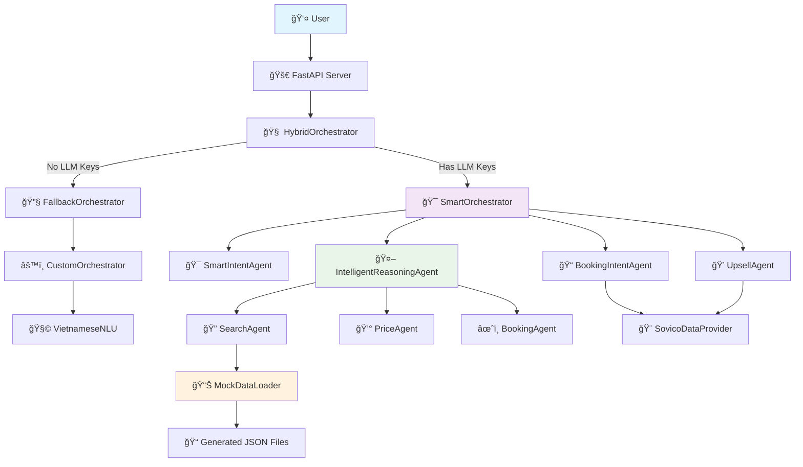
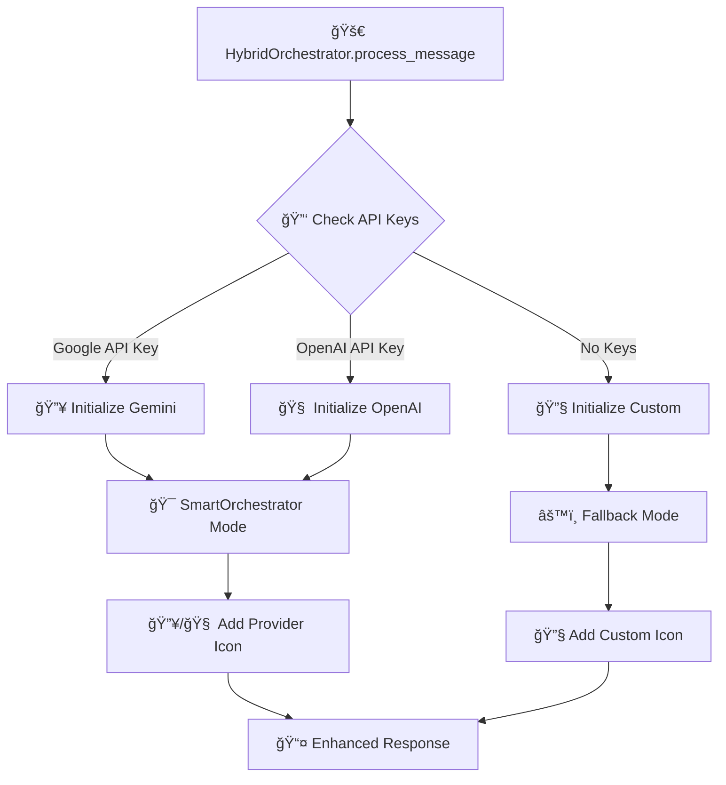
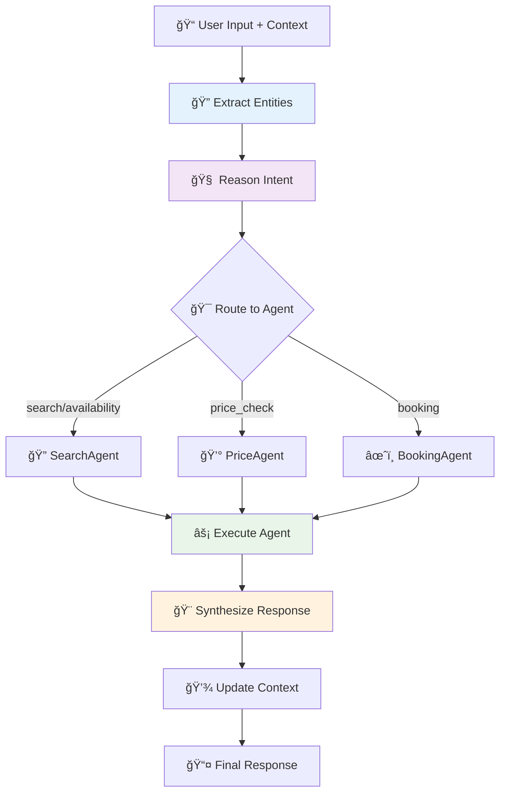
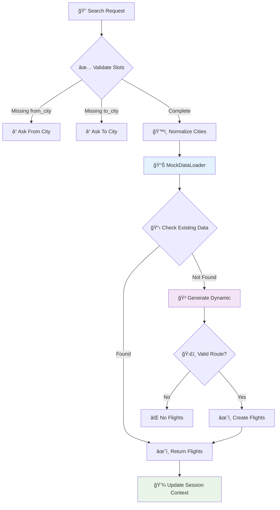
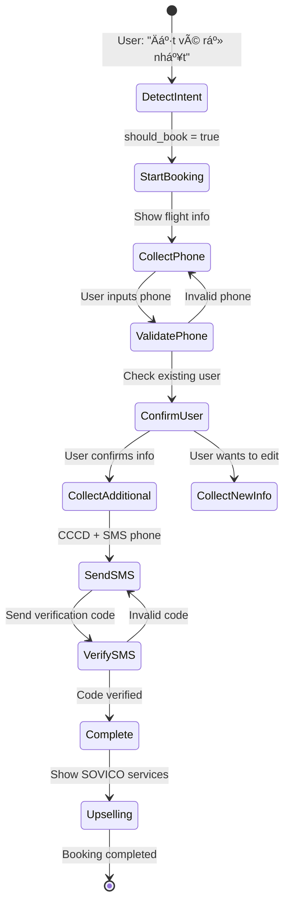
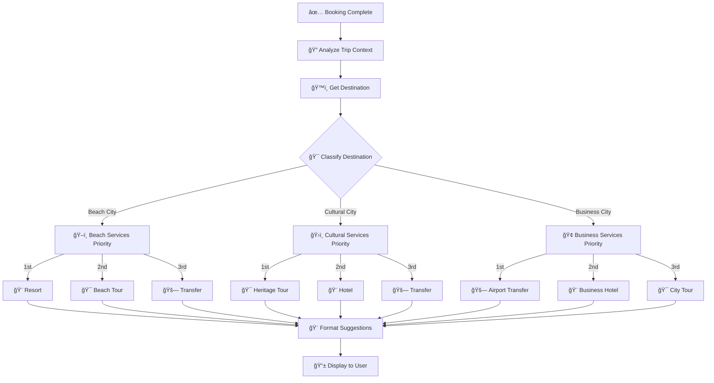
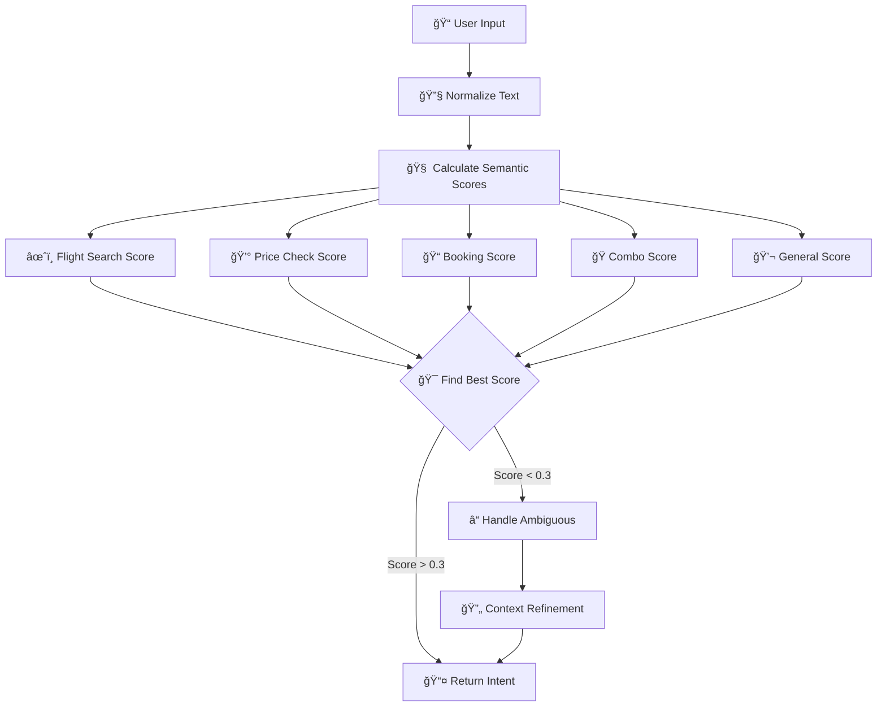

# 🛫 BOOKING AGENT - SYSTEM FLOW & ARCHITECTURE

## 📋 Tá»”NG QUAN HỆ THá»NG

Hệ thống **Booking Agent** là má»™t AI-powered chatbot chuyên vỠđặt vé máy bay VietJet Air và tÆ° vấn dịch vụ du lịch SOVICO. Äược thiết kế theo kiến trúc **Multi-Agent** vá»›i khả năng xá»­ lý ngôn ngữ tá»± nhiên tiếng Việt và conversation flow thông minh.

## ğŸ—ï¸ KIẾN TRÚC Tá»”NG THỂ



## 🚀 ENTRY POINT FLOW

### 1. **main.py - FastAPI Server**


**Chức năng chính:**
- Khởi tạo FastAPI server với endpoint `/chat`
- Nhận `ChatRequest` từ user
- Delegate processing cho `HybridOrchestrator`
- Trả vỠstructured `ChatResponse`

## 🧠 HYBRID ORCHESTRATOR

### **Decision Logic**



**Provider Priority:**
1. **Google Gemini** (🔥) - Primary choice
2. **OpenAI GPT** (🧠) - Secondary choice  
3. **Custom Logic** (🔧) - Fallback

## 🯠SMART ORCHESTRATOR FLOW

### **Main Processing Pipeline**


## 🤖 INTELLIGENT REASONING AGENT

### **Multi-Step Reasoning Process**



### **Entity Extraction vá»›i LLM**

```json
{
  "locations": {"from": "Ho Chi Minh City", "to": "Hanoi"},
  "time": {"date": "ngày mai", "time_preference": "sáng"},
  "passengers": 1,
  "preferences": {"price_range": "cheapest"},
  "intent_signals": ["tìm vé", "rẻ nhất"],
  "conversation_type": "search"
}
```

### **Intent Analysis**

```json
{
  "primary_intent": "search",
  "target_agent": "SearchAgent", 
  "ready_for_action": true,
  "confidence": 0.9
}
```

## 🔠SEARCH AGENT FLOW

### **Flight Search Process**



### **Dynamic Flight Generation**

```python
# Seed-based generation để đảm bảo consistency
seed_string = f"{from_code}-{to_code}-{target_date}"
random.seed(hash(seed_string) % (2**32))

# Generate 5-8 flights vá»›i giá và thá»i gian cố định
flight_times = ["06:00", "08:30", "10:15", "12:45", "15:20", "17:30", "19:45", "21:15"]
base_prices = {"HAN-SGN": 1500000, "SGN-HAN": 1500000, "SGN-DAD": 1200000}
```

## 📠BOOKING FLOW - Multi-Step Process

### **Complete Booking Journey**



### **Booking Session State**

```json
{
  "session_id": "booking_VJ112_1234",
  "step": "collect_phone",
  "flight_info": {
    "flight_id": "VJ112",
    "airline": "VietJet Air",
    "from_city": "Ho Chi Minh City",
    "to_city": "Hanoi",
    "date": "22/09/2025",
    "time": "06:00",
    "price": 1665967
  },
  "phone": "0901234567",
  "cccd": "123456789012",
  "sms_phone": "0901234567"
}
```

### **Booking Steps Detail**

#### **Step 1: Collect Phone**
```
📱 Äể tiếp tục đặt vé, vui lòng cung cấp số Ä‘iện thoại:
(Chúng tôi sẽ kiểm tra thông tin khách hàng có sẵn)
```

#### **Step 2: Confirm User Info**
```
👤 THÔNG TIN KHÃCH HÀNG
HỠtên: Nguyễn Văn A
SÄT: 0901234567
Email: nguyenvana@email.com
Äịa chỉ: 123 Nguyá»…n Huệ, Q1, TP.HCM

✅ Thông tin này có đúng không?
```

#### **Step 3: Collect Additional Info**
```
📠VUI LÒNG CUNG CẤP THÊM:
1. Số CCCD/CMND (12-15 số)
2. SÄT nhận SMS xác thá»±c

Ví dụ: "CCCD: 123456789012, SMS: 0901234567"
```

#### **Step 4: SMS Verification**
```
📱 MÃ XÃC THá»°C ÄÃ GỬI
Mã xác thực đã được gửi đến 0901234567
Vui lòng nhập mã 6 số để hoàn tất đặt vé.

📠Mã test: 123456
```

#### **Step 5: Completion + Upselling**
```
🉠ÄẶT VÉ THÀNH CÔNG!

âœˆï¸ VietJet Air VJ112
📠TP.HCM → Hà Nội  
📅 22/09/2025 lúc 06:00
💰 1.665.967 VNÄ
🆔 Mã booking: SOVICO220925VJ112

🨠DỊCH VỤ BỔ SUNG TẠI HÀ NỘI:
🨠Sovico Grand Hotel Hanoi - 2.200.000đ/đêm
🚗 Xe đón sân bay - 380.000đ/chuyến  
🯠Tour Hà Ná»™i Heritage - 890.000Ä‘/ngÆ°á»i
ğŸ›¡ï¸ Bảo hiểm du lịch - 50.000Ä‘/ngÆ°á»i
```

## 💠UPSELLING SYSTEM

### **Context-Aware Service Suggestions**



### **SOVICO Services Data Structure**

```json
{
  "hotels": {
    "hanoi": [
      {
        "id": "sovico_hn_001",
        "name": "Sovico Grand Hotel Hanoi",
        "rating": 5,
        "price": 2200000,
        "discount": "Giảm 20% + miễn phí breakfast cho khách VietJet",
        "amenities": ["Pool", "Spa", "Gym", "Business Center"]
      }
    ]
  },
  "transfers": {
    "hanoi": {
      "price": 380000,
      "vehicles": ["Toyota Vios", "Toyota Innova", "Mercedes E-Class"],
      "features": ["Tài xế chuyên nghiệp", "Theo dõi chuyến bay real-time"]
    }
  },
  "tours": {
    "hanoi": [
      {
        "name": "Hà Nội Heritage Tour",
        "price": 890000,
        "duration": "1 ngày (8h)",
        "highlights": ["Văn Miếu", "Hồ Hoàn Kiếm", "Phố Cổ"]
      }
    ]
  }
}
```

## 🧩 NLU ENGINE - Vietnamese Processing

### **Intent Detection vá»›i Semantic Scoring**



### **Semantic Keywords vá»›i Trá»ng Số**

```python
semantic_keywords = {
    'flight_search': {
        'strong': ['tìm vé', 'chuyến bay', 'máy bay'],      # 3 điểm
        'medium': ['tìm', 'vé', 'bay', 'chuyến'],          # 1 điểm  
        'weak': ['từ', 'đến', 'đi', 'khởi hành']           # 0.3 điểm
    },
    'price_check': {
        'strong': ['giá vé', 'bao nhiêu tiá»n', 'vé rẻ nhất'],
        'medium': ['giá', 'tiá»n', 'bao nhiêu', 'rẻ'],
        'weak': ['nhất', 'cả', 'thế nào']
    },
    'booking': {
        'strong': ['đặt vé', 'book vé', 'mua vé'],
        'medium': ['đặt', 'book', 'mua', 'chốt'],
        'weak': ['ngay', 'luôn', 'cho tôi']
    }
}
```

### **Slot Extraction - Flexible Parsing**

```mermaid
flowchart TD
    Message[📠Message] --> ExtractLocations[ğŸ™ï¸ Extract Locations]
    ExtractLocations --> PatternDi[🔠Pattern: "X đi Y"]
    ExtractLocations --> PatternFromTo[🔠Pattern: "từ X đến Y"]
    ExtractLocations --> FuzzyMatch[🯠Fuzzy Matching]
    
    Message --> ExtractDates[📅 Extract Dates]
    ExtractDates --> RelativeTime[ⰠRelative: "hôm nay", "ngày mai"]
    ExtractDates --> AbsoluteTime[📆 Absolute: "22/09/2025"]
    ExtractDates --> WeekdayTime[📅 Weekday: "thứ hai"]
    
    Message --> ExtractPrefs[âš™ï¸ Extract Preferences]
    ExtractPrefs --> PricePrefs[💰 "rẻ nhất", "giá rẻ"]
    ExtractPrefs --> TimePrefs[â° "sáng", "chiá»u", "tối"]
    ExtractPrefs --> ClassPrefs[🫠"business", "economy"]
    
    PatternDi --> NormalizeSlots[🔧 Normalize Slots]
    PatternFromTo --> NormalizeSlots
    FuzzyMatch --> NormalizeSlots
    RelativeTime --> NormalizeSlots
    AbsoluteTime --> NormalizeSlots
    WeekdayTime --> NormalizeSlots
    PricePrefs --> NormalizeSlots
    TimePrefs --> NormalizeSlots
    ClassPrefs --> NormalizeSlots
    
    NormalizeSlots --> ReturnSlots[📤 Return Slots]
```

### **Location Mapping**

```python
location_mapping = {
    # Hà Nội
    "hà nội": "HAN", "hanoi": "HAN", "hn": "HAN", "thủ đô": "HAN",
    
    # TP.HCM  
    "hồ chí minh": "SGN", "sài gòn": "SGN", "hcm": "SGN", "sgn": "SGN",
    
    # Äà Nẵng
    "đà nẵng": "DAD", "da nang": "DAD", "Ä‘n": "DAD", "miá»n trung": "DAD"
}
```

## 💾 CONTEXT MANAGEMENT

### **Session Context Structure**

```json
{
  "user_id": "user_123",
  "locations": {
    "from": "Ho Chi Minh City",
    "to": "Hanoi"
  },
  "time": {
    "date": "2025-01-21",
    "time_preference": "sáng"
  },
  "passengers": 1,
  "preferences": {
    "price_range": "cheapest"
  },
  "last_search_result": {
    "success": true,
    "data": {
      "flights": [...]
    }
  },
  "selected_flight_id": "VJ112",
  "booking_session": {
    "session_id": "booking_VJ112_1234",
    "step": "collect_phone",
    "flight_info": {...}
  }
}
```

### **Context Storage Flow**


## 📊 DATA LAYER

### **MockDataLoader Architecture**


### **Dynamic Generation Logic**

```python
# Tạo seed cố định để đảm bảo consistency
seed_string = f"{from_code}-{to_code}-{target_date.strftime('%Y-%m-%d')}"
random.seed(hash(seed_string) % (2**32))

# Generate flights với thông tin cố định
flight_times = ["06:00", "08:30", "10:15", "12:45", "15:20", "17:30", "19:45", "21:15"]
base_prices = {
    "HAN-SGN": 1500000, 
    "SGN-HAN": 1500000, 
    "SGN-DAD": 1200000, 
    "DAD-SGN": 1200000
}

# Số lượng flights: 5-8 chuyến
num_flights = 5 + (hash(seed_string) % 4)

for i, time in enumerate(flight_times[:num_flights]):
    price_variation = 0.8 + (i * 0.15)  # Giá tăng dần theo giá»
    flight = {
        "flight_id": flight_codes[i % len(flight_codes)],
        "time": time,
        "price": int(base_price * price_variation),
        "seats_left": 2 + (i % 6)  # 2-7 chá»—
    }
```

## 🔄 CONVERSATION EXAMPLES

### **Example 1: Simple Flight Search**

```
User: "Tìm vé từ HCM đi HN ngày mai"

System Flow:
1. NLU: intent=flight_search, slots={from_city: "SGN", to_city: "HAN", date: "tomorrow"}
2. SearchAgent: get_flights_by_route_and_date("Ho Chi Minh City", "Hanoi", "2025-01-21")
3. MockDataLoader: generate_dynamic_flights() → 6 flights
4. Response: "🛫 Tìm thấy 6 chuyến bay từ TP.HCM đến Hà Nội"

Bot: "🛫 Tìm thấy 6 chuyến bay từ TP.HCM đến Hà Nội ngày 21/01/2025:

1. âœˆï¸ VietJet Air VJ112
   â° 06:00 - 08:05 (2h05m)
   💰 1.200.000đ
   🪑 Còn 3 ghế

2. âœˆï¸ VietJet Air VJ114  
   â° 08:30 - 10:35 (2h05m)
   💰 1.380.000đ
   🪑 Còn 5 ghế

3. âœˆï¸ VietJet Air VJ116
   â° 10:15 - 12:20 (2h05m) 
   💰 1.560.000đ
   🪑 Còn 2 ghế

Suggestions: [💰 Vé rẻ nhất, 🯠Äặt VJ112, ğŸ Combo du lịch, 📅 Ngày khác]"
```

### **Example 2: Price Check**

```
User: "Vé rẻ nhất bao nhiêu?"

System Flow:
1. Context: có last_search_result từ query trước
2. NLU: intent=price_check, context_aware=true
3. PriceAgent: find cheapest from last_search_result
4. Response: highlight cheapest flight

Bot: "💰 Vé rẻ nhất từ TP.HCM đến Hà Nội ngày 21/01:

âœˆï¸ VietJet Air VJ112
â° 06:00 - 08:05
💰 1.200.000đ (rẻ nhất)
🪑 Còn 3 ghế

Suggestions: [🯠Äặt vé này, â° Xem giá» khác, 📅 Xem ngày khác, 🔠So sánh giá]"
```

### **Example 3: Complete Booking Flow**

```
User: "Äặt vé rẻ nhất"

System Flow:
1. SmartIntentAgent: should_proceed_with_booking() → true
2. BookingIntentAgent: start_booking_process()
3. Create booking_session in context
4. Multi-step collection process

Bot: "🛫 ÄẶT VÉ MÃY BAY

Bạn đã chá»n:
âœˆï¸ VietJet Air VJ112
📠TP.HCM → Hà Nội
📅 21/01/2025 lúc 06:00
💰 1.200.000 VNÄ

📱 Äể tiếp tục đặt vé, vui lòng cung cấp số Ä‘iện thoại:
(Chúng tôi sẽ kiểm tra thông tin khách hàng có sẵn)

Suggestions: [📱 Nhập SÄT, ⌠Hủy đặt vé]"

User: "0901234567"

Bot: "👤 THÔNG TIN KHÃCH HÀNG
HỠtên: Nguyễn Văn A
SÄT: 0901234567
Email: nguyenvana@email.com
Äịa chỉ: 123 Nguyá»…n Huệ, Q1, TP.HCM

✅ Thông tin này có đúng không?

Suggestions: [✅ Äúng, âœï¸ Sá»­a thông tin]"

User: "Äúng"

Bot: "📠VUI LÒNG CUNG CẤP THÊM:
1. Số CCCD/CMND (12-15 số)
2. SÄT nhận SMS xác thá»±c

Ví dụ: 'CCCD: 123456789012, SMS: 0901234567'

Suggestions: [📠Nhập CCCD & SMS]"

User: "CCCD: 123456789012, SMS: 0901234567"

Bot: "📱 MÃ XÃC THá»°C ÄÃ GỬI
Mã xác thực đã được gửi đến 0901234567
Vui lòng nhập mã 6 số để hoàn tất đặt vé.

📠Mã test: 123456

Suggestions: [🔢 Nhập mã SMS]"

User: "123456"

Bot: "🉠ÄẶT VÉ THÀNH CÔNG!

âœˆï¸ VietJet Air VJ112
📠TP.HCM → Hà Nội
📅 21/01/2025 lúc 06:00
💰 1.200.000 VNÄ
🆔 Mã booking: SOVICO210125VJ112

🨠DỊCH VỤ BỔ SUNG TẠI HÀ NỘI:
🨠Sovico Grand Hotel - 2.200.000đ/đêm
🚗 Xe đón sân bay - 380.000đ/chuyến
🯠Tour Hà Ná»™i Heritage - 890.000Ä‘/ngÆ°á»i
ğŸ›¡ï¸ Bảo hiểm du lịch - 50.000Ä‘/ngÆ°á»i

Suggestions: [🨠Khách sạn HN, 🚗 Xe đón HN, 🯠Tour HN, ğŸ›¡ï¸ Bảo hiểm]"
```

## 🯠KEY FEATURES

### **1. Intelligent Context Management**
- Duy trì conversation state qua nhiá»u turns
- Smart context merging và updating
- Session-based booking flow

### **2. Flexible Vietnamese NLU**
- Semantic intent detection vá»›i scoring
- Flexible slot extraction
- Context-aware refinement

### **3. Dynamic Data Generation**
- Seed-based consistency
- Support bất kỳ route/date nào
- Realistic flight data

### **4. Multi-Agent Architecture**
- Specialized agents cho từng task
- Intelligent routing
- Fallback mechanisms

### **5. Smart Upselling**
- Context-aware service suggestions
- Destination-specific recommendations
- SOVICO ecosystem integration

### **6. Robust Error Handling**
- Graceful degradation
- Helpful error messages
- Multiple fallback layers

## 🔧 TECHNICAL SPECIFICATIONS

### **Dependencies**
- **FastAPI**: Web framework
- **LangChain**: LLM integration
- **Google Gemini**: Primary LLM
- **OpenAI GPT**: Secondary LLM
- **Pydantic**: Data validation
- **Custom NLU**: Vietnamese processing

### **Data Storage**
- **JSON Files**: Mock flight data
- **File-based Context**: Session storage
- **In-memory Cache**: Active sessions

### **API Endpoints**
- `POST /chat`: Main conversation endpoint
- `GET /status`: System status
- `GET /`: Health check

### **Configuration**
- Environment variables cho API keys
- Provider selection (auto/gemini/openai)
- Fallback mode support

## 📈 PERFORMANCE & SCALABILITY

### **Response Time**
- **With LLM**: 2-5 seconds
- **Fallback Mode**: <1 second
- **Cached Results**: <500ms

### **Scalability Considerations**
- Stateless design vá»›i external context storage
- Redis integration ready
- Horizontal scaling support

### **Error Recovery**
- LLM failure → Custom logic fallback
- Data missing → Dynamic generation
- Context corruption → Fresh start

---

*Hệ thống Booking Agent được thiết kế để cung cấp trải nghiệm đặt vé máy bay và tÆ° vấn du lịch tá»± nhiên, thông minh và đáng tin cậy cho ngÆ°á»i dùng Việt Nam.*