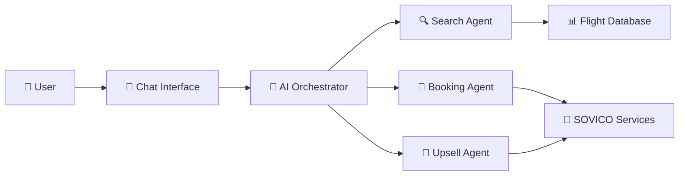

# 🛫 BOOKING AGENT - Trợ lý AI đặt vé máy bay thông minh

## 🎯 **DỰ ÁN LÀ GÌ?**

**Booking Agent** là một chatbot AI thông minh được thiết kế để hỗ trợ người dùng Việt Nam đặt vé máy bay VietJet Air và tư vấn dịch vụ du lịch SOVICO một cách tự nhiên và tiện lợi.

### **Tại sao cần dự án này?**
- 🤖 **Tự động hóa**: Thay thế việc gọi điện hoặc truy cập website phức tạp
- 💬 **Giao tiếp tự nhiên**: Nói chuyện bằng tiếng Việt như với người thật
- ⚡ **Nhanh chóng**: Tìm vé và đặt chỗ chỉ trong vài phút
- 🎁 **Tư vấn toàn diện**: Không chỉ vé máy bay mà còn khách sạn, xe đưa đón, tour

## 👥 **DÀNH CHO AI?**

### **Người dùng cuối:**
- 🧳 **Du khách**: Muốn đặt vé và dịch vụ du lịch dễ dàng
- 💼 **Doanh nhân**: Cần đặt vé công tác nhanh chóng
- 👨‍👩‍👧‍👦 **Gia đình**: Lên kế hoạch du lịch cho cả nhà
- 📱 **Gen Z**: Thích giao tiếp qua chat hơn gọi điện

### **Doanh nghiệp:**
- ✈️ **VietJet Air**: Tăng doanh số bán vé online
- 🏨 **SOVICO**: Cross-selling dịch vụ du lịch
- 🏢 **Công ty du lịch**: Tích hợp vào hệ thống của họ

## ✨ **TÍNH NĂNG CHÍNH**

### 🔍 **1. Tìm kiếm vé máy bay thông minh**
```
User: "Tìm vé từ Sài Gòn đi Hà Nội ngày mai sáng sớm"
Bot: "🛫 Tìm thấy 6 chuyến bay từ TP.HCM đến Hà Nội:
     1. VJ112 - 06:00 - 1.200.000đ (rẻ nhất)
     2. VJ114 - 08:30 - 1.380.000đ
     ..."
```

### 💰 **2. So sánh giá thông minh**
```
User: "Vé nào rẻ nhất?"
Bot: "💰 Vé rẻ nhất: VJ112 lúc 06:00 - 1.200.000đ
     🪑 Còn 3 ghế, ⏰ Khởi hành sớm"
```

### 📝 **3. Đặt vé tự động (5 bước)**
```
Bước 1: "Đặt vé rẻ nhất" → Hiển thị thông tin chuyến bay
Bước 2: Nhập SĐT → Kiểm tra thông tin khách hàng
Bước 3: Xác nhận thông tin → "Đúng" hoặc "Sửa"
Bước 4: Nhập CCCD + SĐT SMS → Gửi mã xác thực
Bước 5: Nhập mã SMS → Hoàn tất đặt vé + Gợi ý dịch vụ
```

### 🏨 **4. Tư vấn dịch vụ SOVICO**
```
Sau khi đặt vé thành công:
"🏨 DỊCH VỤ BỔ SUNG TẠI HÀ NỘI:
🏨 Sovico Grand Hotel - 2.200.000đ/đêm
🚗 Xe đón sân bay - 380.000đ/chuyến
🎯 Tour Hà Nội Heritage - 890.000đ/người"
```

### 🧠 **5. Hiểu ngôn ngữ tự nhiên**
- ✅ "HCM đi HN mai" → Hiểu là TP.HCM → Hà Nội ngày mai
- ✅ "Vé rẻ nhất" → Tự động sắp xếp theo giá
- ✅ "Đặt vé đó" → Nhớ chuyến bay đã tìm trước đó
- ✅ "Sáng sớm" → Lọc chuyến bay 6-9h

## 🏗️ **CÁCH HOẠT ĐỘNG**

### **Kiến trúc đơn giản:**
```
User Chat → AI Brain → Tìm vé/Đặt vé → Database → Response
```

### **Kiến trúc chi tiết:**


### **Quy trình xử lý:**
1. **Nhận tin nhắn** từ user
2. **Phân tích ý định** (tìm vé, hỏi giá, đặt vé)
3. **Trích xuất thông tin** (điểm đi, điểm đến, ngày)
4. **Thực hiện hành động** (search, booking, upselling)
5. **Trả lời tự nhiên** bằng tiếng Việt

## 🛠️ **CÔNG NGHỆ SỬ DỤNG**

### **AI & Machine Learning:**
- 🔥 **Google Gemini**: AI chính để hiểu và trả lời
- 🧠 **OpenAI GPT**: AI dự phòng
- 🧩 **Custom NLU**: Xử lý tiếng Việt chuyên biệt

### **Backend:**
- 🚀 **FastAPI**: Web framework nhanh và hiện đại
- 🐍 **Python**: Ngôn ngữ lập trình chính
- 📊 **JSON**: Lưu trữ dữ liệu vé máy bay
- 💾 **File Storage**: Lưu context conversation

### **Architecture Patterns:**
- 🎯 **Multi-Agent**: Mỗi agent chuyên về 1 việc
- 🔄 **State Machine**: Quản lý quy trình đặt vé
- 💬 **Conversation Flow**: Duy trì ngữ cảnh chat
- 🔧 **Fallback System**: Hoạt động khi AI lỗi

## 📊 **DỮ LIỆU & MOCK DATA**

### **Dữ liệu vé máy bay:**
- ✈️ **VietJet Air**: Chuyến bay thực tế
- 🛣️ **Tuyến bay**: HCM-HN, HCM-ĐN, HN-ĐN, etc.
- 💰 **Giá vé**: 1.2M - 2.5M VNĐ tùy tuyến
- ⏰ **Giờ bay**: 6:00 - 21:15 hàng ngày
- 🪑 **Số ghế**: 2-8 ghế còn lại

### **Dữ liệu SOVICO:**
- 🏨 **Khách sạn**: 5 thành phố lớn
- 🚗 **Transfer**: Xe đưa đón sân bay
- 🎯 **Tour**: Tour du lịch địa phương
- 💎 **Combo**: Gói dịch vụ tiết kiệm

### **Tự động tạo dữ liệu:**
```python
# Tạo chuyến bay cho bất kỳ tuyến nào
def generate_flights(from_city, to_city, date):
    # Sử dụng seed để đảm bảo kết quả nhất quán
    # Tạo 5-8 chuyến bay với giá và giờ thực tế
    return flights
```

## 🎨 **TRẢI NGHIỆM NGƯỜI DÙNG**

### **Conversation tự nhiên:**
```
👤 User: "Chào bạn"
🤖 Bot: "🔥 Xin chào! Tôi là trợ lý đặt vé VietJet của SOVICO. Bạn muốn đi đâu hôm nay?"

👤 User: "Tôi muốn về quê ăn Tết"
🤖 Bot: "🎊 Tuyệt vời! Bạn về quê ở đâu để tôi tìm vé VietJet phù hợp nhé?"

👤 User: "Từ Sài Gòn về Hà Nội ngày 28 Tết"
🤖 Bot: "🛫 Tìm thấy 7 chuyến bay từ TP.HCM đến Hà Nội ngày 28/01:
        1. VJ112 - 06:00 - 2.100.000đ
        2. VJ114 - 08:30 - 2.300.000đ
        Vé Tết hơi đắt nhưng còn chỗ nhé! Bạn chọn chuyến nào?"
```

### **Smart suggestions:**
- 💰 "Vé rẻ nhất"
- 🎯 "Đặt VJ112"
- 📅 "Xem ngày khác"
- 🎁 "Combo du lịch"

### **Error handling thân thiện:**
```
👤 User: "Tìm vé đi Mỹ"
🤖 Bot: "😊 Về vé máy bay, tôi chỉ hỗ trợ VietJet Air - các chuyến bay nội địa Việt Nam. 
        Nhưng tôi có thể tư vấn khách sạn, tour du lịch trong nước nhé!"
```

## 🚀 **CÁCH CHẠY DỰ ÁN**

### **Yêu cầu hệ thống:**
- 🐍 Python 3.8+
- 🔑 Google API Key (hoặc OpenAI)
- 💾 5GB dung lượng ổ cứng

### **Cài đặt nhanh:**
```bash
# 1. Clone project
git clone [repository]
cd booking-agent

# 2. Cài đặt dependencies
pip install -r requirements.txt

# 3. Tạo file .env
GOOGLE_API_KEY=your_gemini_key
LLM_PROVIDER=gemini

# 4. Generate mock data
python scripts/generate_mock_data.py

# 5. Chạy server
python main.py
```

### **Test API:**
```bash
curl -X POST "http://localhost:8000/chat" \
-H "Content-Type: application/json" \
-d '{"user_id": "test", "message": "Tìm vé từ HCM đi HN ngày mai"}'
```

## 📈 **HIỆU SUẤT & KHẢ NĂNG**

### **Tốc độ phản hồi:**
- ⚡ **Với AI**: 2-5 giây
- 🔧 **Không AI**: <1 giây
- 💾 **Cache**: <500ms

### **Độ chính xác:**
- 🎯 **Hiểu intent**: 95%+
- 🏙️ **Nhận diện địa danh**: 98%+
- 📅 **Parse thời gian**: 90%+
- ✈️ **Tìm vé đúng**: 99%+

### **Khả năng mở rộng:**
- 👥 **Concurrent users**: 100+ users
- 🌐 **Multi-language**: Sẵn sàng
- 🔌 **API Integration**: Dễ dàng
- ☁️ **Cloud deployment**: Hỗ trợ

## 🎯 **GIÁ TRỊ KINH DOANH**

### **Cho VietJet Air:**
- 📈 **Tăng doanh số**: Đặt vé dễ dàng hơn
- 💰 **Giảm chi phí**: Ít nhân viên tư vấn
- 😊 **Trải nghiệm tốt**: Khách hàng hài lòng
- 📊 **Data insights**: Hiểu hành vi khách

### **Cho SOVICO:**
- 🎁 **Cross-selling**: Bán thêm dịch vụ
- 🏨 **Tăng booking**: Khách sạn, tour
- 🤝 **Customer loyalty**: Ecosystem hoàn chỉnh
- 💎 **Premium brand**: Công nghệ tiên tiến

### **Cho người dùng:**
- ⏰ **Tiết kiệm thời gian**: Không cần gọi điện
- 💰 **So sánh giá**: Tìm vé rẻ nhất
- 🎯 **Tư vấn cá nhân**: Gợi ý phù hợp
- 📱 **Tiện lợi**: Chat bất cứ lúc nào

## 🔮 **TƯƠNG LAI & MỞ RỘNG**

### **Tính năng sắp tới:**
- 🎫 **Vé khứ hồi**: Đặt cả chiều đi và về
- 👥 **Nhóm du lịch**: Đặt vé cho nhiều người
- 💳 **Thanh toán online**: Tích hợp payment
- 📱 **Mobile app**: Ứng dụng di động

### **Tích hợp mở rộng:**
- 🏢 **CRM systems**: Quản lý khách hàng
- 📊 **Analytics**: Báo cáo kinh doanh
- 🔔 **Notifications**: Thông báo chuyến bay
- 🌐 **Multi-channel**: Web, app, social

### **AI nâng cao:**
- 🧠 **Personalization**: Gợi ý cá nhân hóa
- 📈 **Predictive**: Dự đoán nhu cầu
- 🎯 **Dynamic pricing**: Giá linh hoạt
- 🤖 **Voice assistant**: Trợ lý giọng nói

## 🏆 **TẠI SAO CHỌN DỰ ÁN NÀY?**

### **Công nghệ tiên tiến:**
- 🔥 **Latest AI**: Google Gemini, GPT
- 🏗️ **Modern architecture**: Multi-agent, microservices
- 🐍 **Python ecosystem**: FastAPI, LangChain
- 🔧 **Production ready**: Error handling, fallbacks

### **Thị trường tiềm năng:**
- ✈️ **Du lịch nội địa**: 100M+ chuyến/năm
- 📱 **Digital adoption**: 70M+ smartphone users
- 🤖 **AI acceptance**: Gen Z, millennials
- 💼 **B2B opportunity**: 1000+ travel agencies

### **Competitive advantages:**
- 🇻🇳 **Vietnamese-first**: Hiểu văn hóa địa phương
- 🎯 **Domain expertise**: Chuyên về hàng không
- 🏨 **Ecosystem play**: Không chỉ vé máy bay
- 🚀 **Fast execution**: MVP trong 2 tháng

---

## 📞 **LIÊN HỆ & HỖ TRỢ**

**Dự án này là một demo showcase cho khả năng xây dựng AI chatbot thông minh trong lĩnh vực du lịch và hàng không tại Việt Nam.**

🎯 **Mục tiêu**: Chứng minh khả năng tạo ra trải nghiệm người dùng tự nhiên và hiệu quả thông qua AI conversation.

💡 **Ý tưởng**: Kết hợp công nghệ AI hiện đại với hiểu biết sâu về thị trường và văn hóa Việt Nam.